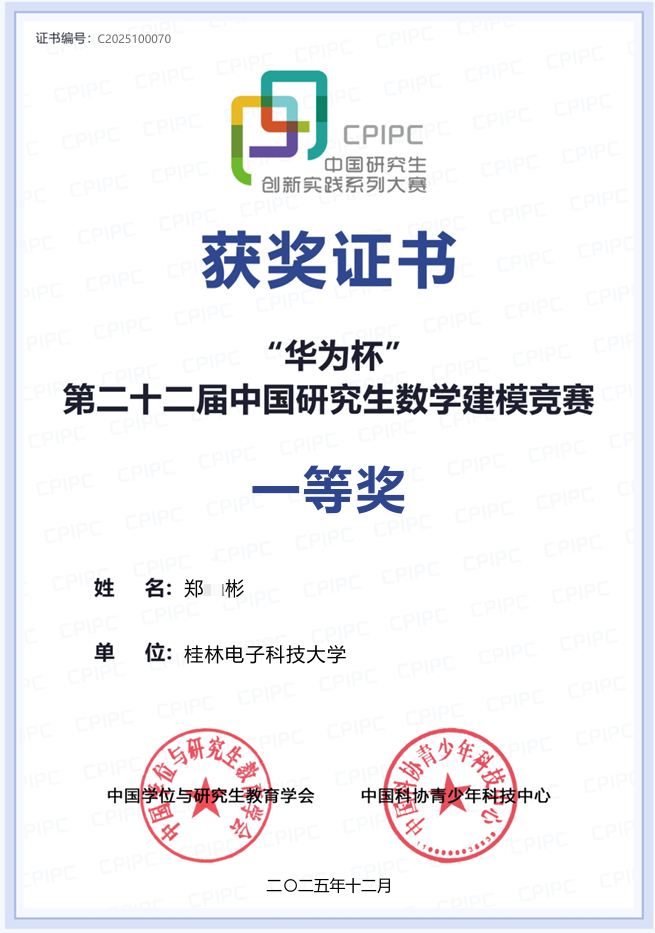

# 2025 Huawei Cup - Rock Fracture Modeling

本项目为本人及队友 2025 年第二十二届中国研究生数学建模竞赛 C 题《围岩裂隙精准识别与三维模型重构》的参赛论文。

作品获得全国一等奖。

## 解决思路

论文围绕钻孔成像中的裂隙识别、定量分析和三维重构展开，主要方案如下：

1. **裂隙像素识别**：采用灰度化、高斯增强、Otsu 分割、梯度与 Laplacian 零交叉融合、霍夫变换及形态学处理，降低岩石纹理、泥浆污染、钻进痕迹和拼接线的干扰。
2. **正弦状裂隙拟合**：使用 RANSAC 完成鲁棒初始拟合，再通过 Huber 回归精细优化，并利用 DBSCAN 对裂隙的倾向特征进行聚类。
3. **复杂裂隙粗糙度分析**：提取裂隙轮廓并计算 JRC，对比等间隔、等弧长、曲率自适应和 Douglas-Peucker 等采样方法。
4. **三维重构与补孔优化**：结合裂隙姿态、空间位置和 JRC 分析多钻孔裂隙连通性，完成三维结构重构，并利用信息熵、贪心算法和非极大值抑制确定补充钻孔位置。

## 项目文件

- [参赛论文](paper.pdf)
- [获奖证书](certificate.png)

## 说明

仅用于学习与交流。
